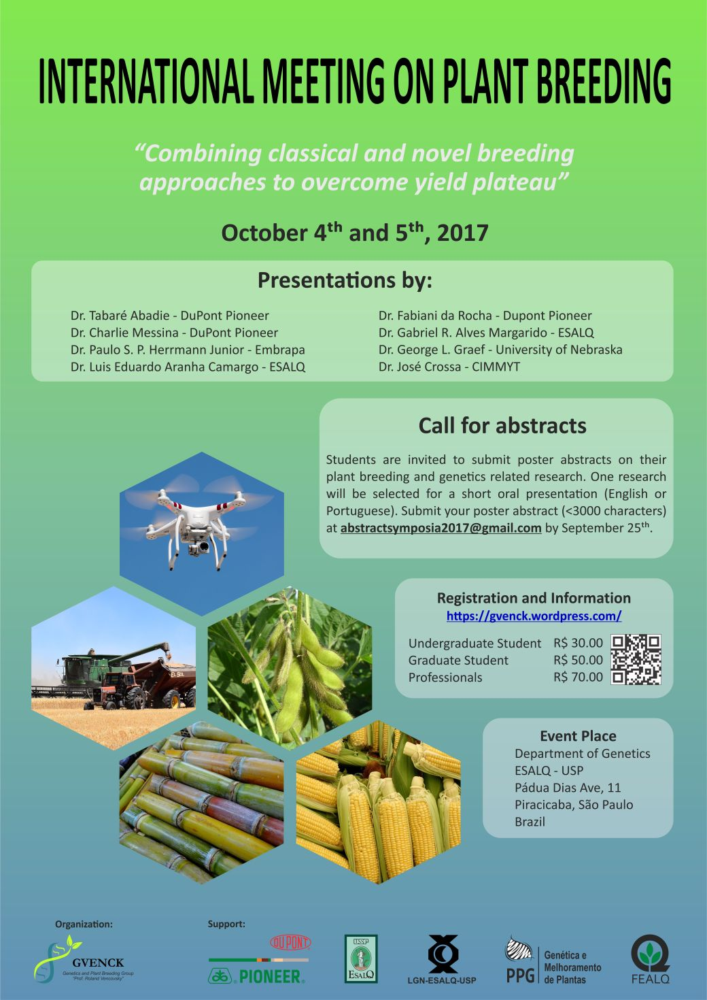

<h1>I INTERNATIONAL MEETING ON PLANT BREEDING</h1>

The **“I INTERNATIONAL MEETING ON PLANT BREEDING“** was part of [DuPont Plant Sciences Symposia Series](http://www.pioneer.com/symposia), and took place at the “Luiz de Queiroz” College of Agriculture (ESALQ/USP) on October 4-5th, 2017, featuring the theme: *“Combining classical and novel breeding approaches to overcome yield plateau”*.

Speakers:  
Dr. Tabaré Abadie – DuPont Pioneer – USA  
Dr. Charlie Messina – DuPont Pioneer – USA  
Dr. Paulo S. P. Herrmann Junior – EMBRAPA – Brazil  
Dr. Luis Eduardo Aranha Camargo – ESALQ/USP – Brazil  
Dr. Fabiani da Rocha – DuPont Pioneer – Brazil  
Dr. Gabriel  R. Alves Margarido – ESALQ/USP – Brazil  
Dr. George L. Graef – University of Nebraska – USA  
Dr. José Crossa – CIMMYT – Mexico  
  
Students were invited to submit poster abstracts on their plant breeding and genetics related research. One research were selected for a short oral presentation (English or Portuguese).

**Event place:**  
Department of Genetics, “Luiz de Queiroz” College of Agriculture (ESALQ/USP)  
Pádua Dias Avenue, 11  
Piracicaba – Sao Paulo State  
Brazil  
  
**Fees:**  
Undergraduate students: R$30,00  
Graduate students: R$50,00  
Professionals: R$70,00  
Mini-Course: R$30,00 (participants) / R$100,00 (non-participants)  
Official Event Dinner: R$50,00  

## Program

**October 4th (Wednesday)**

Morning:

07:00 – 08:00 – Registration

08:00 – 08:45 – Opening Session – Tabare Abadie (DuPont Pioneer)

08:45 – 09:45 – Lecture 1 – Enhancing Yield Gains in Soybean
George Graef (University of Nebraska)

09:45 – 10-15 – Coffee Break

10:15 – 11:15 – Lecture 2 – Improving phenotypic prediction through crop model-whole genome prediction integration
Charlie Messina (DuPont Pioneer)

11:15 – 12:00 – Poster Session 1

12:00 – 14:00 – Lunch

Afternoon:

14:00 – 15:00 – Lecture 3 – Advanced methods to study plant phenotyping of stress responses (TBC)
Paulo Herrmann (EMBRAPA)

15:00 – 16:00 – Lecture 4 – Plant Breeding for Disease Resistance
Luís Eduardo Aranha Camargo (USP/ESALQ)

16:00- 16:30 – Coffee Break

16:30 – 17:30 – Lecture 5 – Smart Breeding: tools and technologies to increase gene
tic gain in maize
Fabiani Rocha (DuPont Pionner)

17:30 – 18:00 – Poster Session 2

19:00h – Official Event Dinner

**October 5th (Thursday)**

Morning:

08:30 – 09:30 – Lecture 6 – Genomic Selection in Plant Breeding: Why? and How?
José Crossa (CIMMYT)

09:30 – 09:45 – Student Oral Presentation

09:45 – 10:15 – Coffee Break

10:15 – 11:15 – Lecture 7 – Applications of Genomics in Polyploid Crops
Gabriel Rodrigues Alves Margarido (USP/ESALQ)

11:15 – 11:30 – Closing Remarks

### “SPECIAL MINI-COURSE”

Title: Modeling G × E interaction in Genomic Prediction Analysis  
Instructor: José Crossa  
Fees: R$30,00 (for participants) / R$100,00 (non-participants)  
Requirements: Basic statistics and R software knowledge / laptop with R software installed and updated  
  
**Thursday – October 5th**

13:30 – 15:00 – Introduction to multi-environmental trials  
– Individual analysis of trials  
– Combined analysis  

15:00 – 15:20 – Coffee Break  

15:30 – 17:30 Genomic prediction models for G×E (Pt 1)  
– Single-environment, main genotypic effect model (SM)  
– Multi-environment, main genotypic effect model (MM)  
– Multi-environment, single variance G × E deviation model (MDs)  

**Friday – October 6th**

8:30 – 9:30 Genomic prediction models for G×E (Pt 2)  
– Multiple-environment environment-specific variance G×E deviation model (MDe)  
– Variance-Covariance model  

9:30 – 9:50 – Coffee Break  

10:00 – 12:30 – Installation of R packages and download of datasets  
– Individual analysis of trials  
– Combined analysis  
– Validation schemes (CV1, CV2)  

12:30 – 12:40 – Closing Remarks

